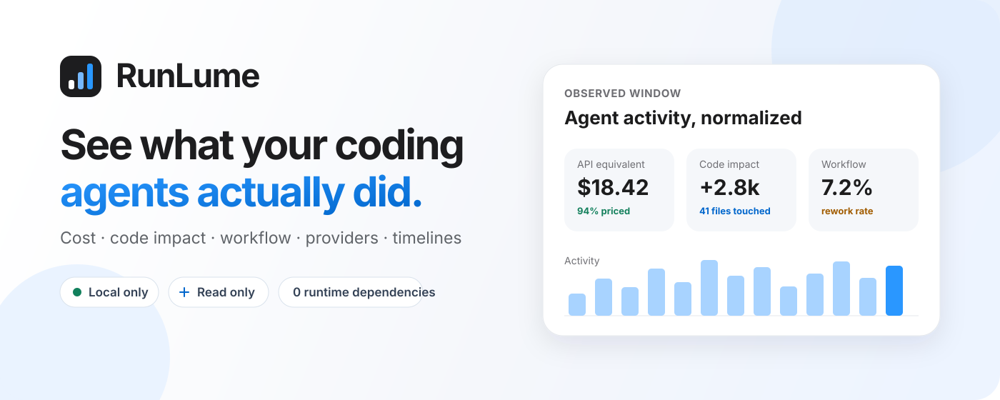
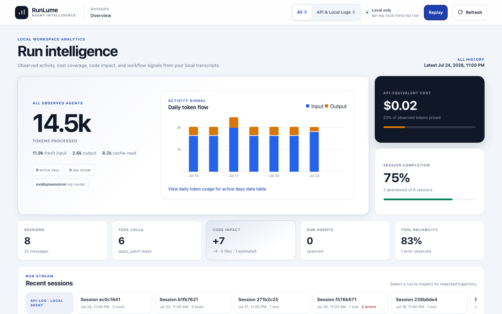
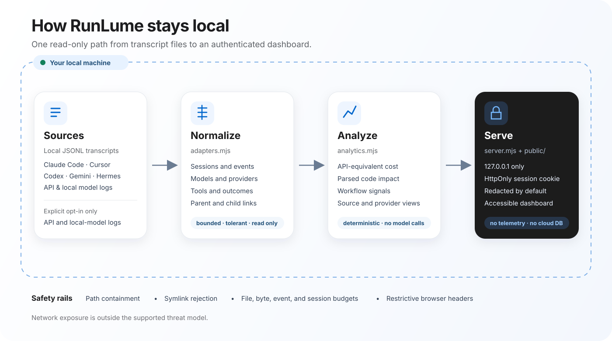
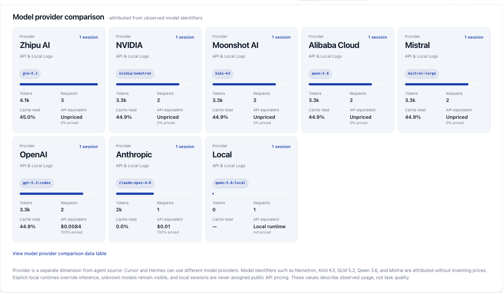

# RunLume

<p align="center">
  
</p>

<p align="center">
  <strong>See what your coding agents actually did.</strong><br />
  Cost, code impact, workflow signals, provider comparison, and session timelines from local transcripts.
</p>

<p align="center">
  <a href="https://github.com/mlvpatel/RunLume/actions/workflows/ci.yml"></a>
  <a href="https://nodejs.org/"></a>
  <a href="./package.json"></a>
  <a href="./LICENSE"></a>
</p>

<p align="center">
  <a href="./docs/runlume-tour.mp4">Watch the 30-second narrated tour</a> ·
  <a href="#quick-start">Quick start</a> ·
  <a href="./docs/architecture.md">Architecture</a> ·
  <a href="./SECURITY.md">Security</a>
</p>

RunLume reads transcripts that supported AI coding tools already store on your
machine. It normalizes their different event formats, calculates observed
metrics, and serves a dependency-free dashboard on localhost. It does not proxy
model requests, connect to vendor accounts, or upload transcript data.

## Live local capture

[](./docs/runlume-tour.mp4)

The [narrated MP4](./docs/runlume-tour.mp4) includes an English subtitle track.
Separate [WebVTT](./docs/runlume-tour.en.vtt), [SRT](./docs/runlume-tour.en.srt),
and [transcript](./docs/runlume-tour-script.md) files are also provided. This is
not a design mockup: [`scripts/capture-demo.mjs`](./scripts/capture-demo.mjs)
starts the real loopback server, opens the authenticated application, and
records real dashboard interactions using the repository's synthetic sample.
No personal transcript, account, credential, or local usage data appears in
the screenshot or video.

## What it helps you answer

| Question | RunLume view |
|---|---|
| What would this observed usage cost at public API rates? | Per-session estimates, pricing coverage, and optional plan comparison |
| What code did the agents report changing? | Additions, removals, touched files, churn, and repeat edits |
| Where does the workflow break down? | Corrections, abandoned runs, tool errors, rework, and time to first edit |
| Which agent or model provider fits my workflow? | Source and provider comparisons using the same normalized metrics |
| What happened inside one run? | A paginated, redacted-by-default event trajectory with sub-agent links |

These metrics describe transcript activity. They do not prove task quality,
correctness, or code authorship.

## Quick start

Requirements: Node.js 22 or 24. RunLume has no runtime dependencies and no build
step.

```bash
git clone https://github.com/mlvpatel/RunLume.git
cd RunLume
npm start
```

Open the authenticated URL printed in the terminal:

```text
http://127.0.0.1:4477/#token=<per-launch-token>
```

The token moves from the URL fragment into tab-scoped storage and is sent as a
Bearer token for API requests. A server restart invalidates it.

To explore without any installed agent CLI:

```bash
npm run sample
```

The sample includes synthetic edits, a correction, an abandoned run, a failed
tool call, and observed model identifiers from several providers. Opening
`public/index.html` directly will not load data; the dashboard needs the local
server and its access token.

## How it works

<p align="center">
  
</p>

1. **Discover.** Read-only adapters find supported local transcript files or an
   explicit import directory.
2. **Normalize.** Each source becomes one bounded session-and-event model.
3. **Analyze.** RunLume calculates token usage, API-equivalent cost, parsed code
   impact, workflow signals, source comparison, and provider comparison.
4. **Protect.** The API replaces local identifiers and transcript text with
   redacted values unless the user explicitly reveals one trajectory.
5. **Render.** A localhost server delivers the accessible HTML, CSS, SVG charts,
   and JavaScript dashboard.

The full [architecture guide](./docs/architecture.md) explains trust boundaries,
data flow, caching, metric logic, and extension points.

## Supported data sources

| Source | Default discovery | Important limit |
|---|---|---|
| Claude Code | `~/.claude/projects` | Task sidechains become child sessions |
| Cursor | `~/.cursor/projects/*/agent-transcripts` | Native transcripts omit event timestamps and token usage |
| Codex CLI | `~/.codex/sessions` | Supports current and legacy rollout records |
| Gemini CLI | `~/.gemini/tmp/*/chats` | Supports saved chats and headless `stream-json` |
| Hermes | `~/.hermes` | Best-effort tolerant parser |
| Provider and local-model logs | Explicit `--import-dir` only | Reads documented JSONL captures; never credentials |

Provider and source are separate dimensions. A Cursor or Hermes session may use
an OpenAI, Anthropic, Google, NVIDIA, Moonshot AI, Zhipu AI, Alibaba Cloud,
Mistral, local, or other model. Model identifiers such as Nemotron, Kimi K3,
GLM 5.2, Qwen 3.6, and Mistral remain visible even when no verified pricing row
exists. Explicit Ollama and LM Studio sessions always remain local and unpriced.



Product names belong to their respective owners. RunLume is independent and is
not endorsed by those vendors.

## Metric logic

| Signal | Definition |
|---|---|
| API-equivalent cost | Observed tokens multiplied by the matching dated rate in `pricing.json` |
| Parsed code impact | Successful edit payloads reconstructed with bounded line-diff logic |
| Rework loop | The same project file is edited again in one session |
| Churn | Repeated touches to the same project file across sessions |
| Abandoned | A non-live, user-started trajectory ends without a final assistant response |
| Correction | A later user message matches the documented correction phrase set |
| Time to first edit | First user event to first successful parseable edit |
| Cache efficiency | Cache-read tokens divided by total input tokens |

Unknown models stay visibly unpriced. Whole-file writes and incomplete delete
payloads are marked as estimates. See the [reference guide](./docs/reference.md)
for formulas, command-line options, environment variables, imports, and limits.

## Privacy and security

RunLume is designed for one trusted user on one machine:

- binds only to `127.0.0.1`;
- validates Host and Origin values to reduce DNS-rebinding risk;
- requires a random per-launch token for every API route;
- redacts transcript content and local identifiers by default;
- reads agent state without modifying it;
- rejects symbolic links and paths outside configured roots;
- bounds file size, total bytes, files, events, sessions, API strings, and refresh rate;
- ships no telemetry, cloud database, analytics SDK, or runtime package dependency.

Do not expose the port through a tunnel, proxy, container publication, or
network forwarding rule. Screenshots and raw API responses can contain prompts,
reasoning, tool arguments, results, and local paths after the reveal action.

Read the [security policy and threat model](./SECURITY.md) before changing the
network boundary. Report vulnerabilities through GitHub's private vulnerability
reporting, not a public issue.

## Data quality and limits

RunLume reports malformed rows, unreadable or oversized files, rejected links,
out-of-root paths, adapter failures, timestamp problems, ambiguous child links,
and every resource budget reached. A clean dashboard does not guarantee a
complete source transcript: some CLIs omit model, token, time, or tool-result
fields.

The default window is 30 days. Complete qualifying sessions are analyzed so
totals remain internally consistent. In all-history mode, totals include every
accepted session while daily charts show at most the latest 730 active days.

## Develop and verify

```bash
npm run check
npm test
npm run sample
```

For browser, accessibility, or release changes:

```bash
pnpm install --frozen-lockfile
pnpm exec playwright install chromium firefox webkit
pnpm run test:e2e
npm run test:package
```

CI covers Node.js 22, 24, and 26 on Linux, Node.js 24 on macOS and Windows,
Chromium/Firefox/WebKit end-to-end behavior, axe WCAG A/AA checks, and a packed
artifact install-and-execute smoke test.

## Project map

| Path | Responsibility |
|---|---|
| `adapters.mjs` | Source discovery and transcript normalization |
| `analytics.mjs` | Pricing, code impact, workflow, source, and provider metrics |
| `server.mjs` | Bounded scanning, redacted API, authentication, and localhost server |
| `public/` | Dependency-free dashboard interface |
| `sample/` | Synthetic demo generator |
| `test/` | Unit, HTTP, browser, accessibility, and regression coverage |

## Documentation

- [Architecture and trust boundaries](./docs/architecture.md)
- [CLI, imports, pricing, metrics, and limits](./docs/reference.md)
- [Security policy](./SECURITY.md)
- [Contribution guide](./CONTRIBUTING.md)
- [Support](./.github/SUPPORT.md)
- [Changelog](./CHANGELOG.md)

## License

[MIT](./LICENSE)
