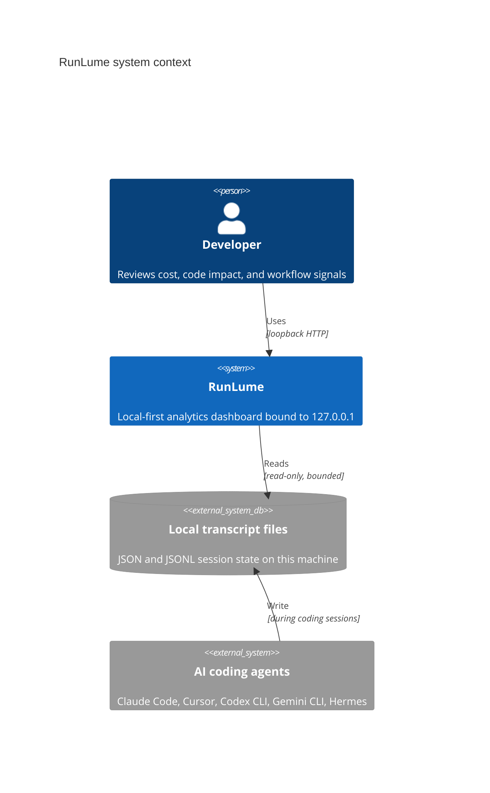
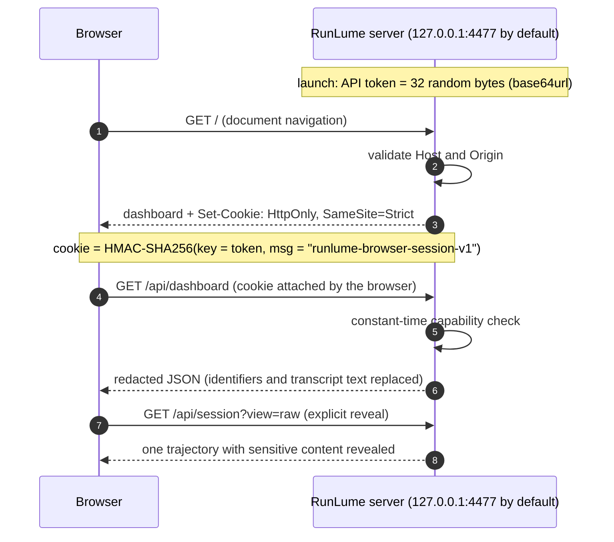

# RunLume

<p align="center">
  
</p>

<p align="center">
  <strong>See what your coding agents actually did.</strong><br />
  Cost, code impact, workflow signals, provider comparison, and session timelines from local transcripts.
</p>

<p align="center">
  <a href="https://github.com/mlvpatel/RunLume/actions/workflows/ci.yml"></a>
  <a href="https://nodejs.org/"></a>
  <a href="./package.json"></a>
  <a href="./LICENSE"></a>
</p>

<p align="center">
  <a href="https://raw.githubusercontent.com/mlvpatel/RunLume/main/docs/runlume-tour.mp4">Watch the 30-second narrated tour</a> ·
  <a href="#quick-start">Quick start</a> ·
  <a href="https://github.com/mlvpatel/RunLume/blob/main/docs/architecture.md">Architecture</a> ·
  <a href="https://github.com/mlvpatel/RunLume/blob/main/SECURITY.md">Security</a>
</p>

RunLume reads transcripts that supported AI coding tools already store on your
machine. It normalizes their different event formats, calculates observed
metrics, and serves a dependency-free dashboard on localhost. It does not proxy
model requests, connect to vendor accounts, or upload transcript data.

## Live local capture

[](https://raw.githubusercontent.com/mlvpatel/RunLume/main/docs/runlume-tour.mp4)

The [narrated MP4](https://raw.githubusercontent.com/mlvpatel/RunLume/main/docs/runlume-tour.mp4) includes an English subtitle track.
Separate [WebVTT](https://raw.githubusercontent.com/mlvpatel/RunLume/main/docs/runlume-tour.en.vtt), [SRT](https://raw.githubusercontent.com/mlvpatel/RunLume/main/docs/runlume-tour.en.srt),
and [transcript](https://github.com/mlvpatel/RunLume/blob/main/docs/runlume-tour-script.md) files are also provided. This is
not a design mockup: [`scripts/capture-demo.mjs`](https://github.com/mlvpatel/RunLume/blob/main/scripts/capture-demo.mjs)
starts the real loopback server, opens the authenticated application, and
records real dashboard interactions using the repository's synthetic sample.
On macOS it generates narration offline with `say` and uses full FFmpeg to
atomically encode H.264 video, AAC audio, and the embedded English subtitle
track. Other systems can supply approved local audio through
`RUNLUME_NARRATION_FILE`; the capture never calls a cloud text-to-speech API.
No personal transcript, account, credential, or local usage data appears in
the screenshot or video.

## What it helps you answer

| Question | RunLume view |
|---|---|
| What would this observed usage cost at public API rates? | Per-session estimates, pricing coverage, and optional plan comparison |
| What code did the agents report changing? | Additions, removals, touched files, churn, and repeat edits |
| Where does the workflow break down? | Corrections, abandoned runs, tool errors, rework, and time to first edit |
| Which agent or model provider fits my workflow? | Source and provider comparisons using the same normalized metrics |
| What happened inside one run? | A paginated, redacted-by-default event trajectory with sub-agent links |

These metrics describe transcript activity. They do not prove task quality,
correctness, or code authorship.

## Quick start

Requirements: Node.js 22 or 24 LTS. Node.js 26 is tested for forward
compatibility. RunLume has no runtime dependencies and no build step.

Run the published package directly:

```bash
npx -y runlume@0.3.3
```

Or clone the repository, which also provides the synthetic sample:

```bash
git clone https://github.com/mlvpatel/RunLume.git
cd RunLume
npm start
```

Open the local URL printed in the terminal:

```text
http://127.0.0.1:4477/
```

The first document response creates an `HttpOnly`, `SameSite=Strict` session
cookie containing a per-launch browser-session capability derived with HMAC from the
per-launch secret. JavaScript cannot read it, the raw API token is never placed
in the cookie, and a server restart invalidates it. Its port-specific name keeps
concurrent loopback services separate, while a restart on the same port
overwrites the stale capability.

To explore without any installed agent CLI:

```bash
npm run sample
```

The sample includes synthetic edits, a correction, an abandoned run, a failed
tool call, and observed model identifiers from several providers. Opening
`public/index.html` directly will not load data; the dashboard needs the local
server and its `HttpOnly` session cookie.

## How it works

<p align="center">
  
</p>

1. **Discover.** Read-only adapters find supported local transcript files or an
   explicit import directory.
2. **Normalize.** Each source becomes one bounded session-and-event model.
3. **Analyze.** RunLume calculates token usage, API-equivalent cost, parsed code
   impact, workflow signals, source comparison, and provider comparison.
4. **Protect.** The API replaces local identifiers and transcript text with
   redacted values unless the user explicitly reveals one trajectory.
5. **Render.** A localhost server delivers the accessible HTML, CSS, SVG charts,
   and JavaScript dashboard.

### System context



Everything lives on one machine: the agent CLIs write transcripts as a side
effect of normal use, and RunLume reads them without modifying anything.

### Data flow

```mermaid
flowchart LR
  subgraph disk["Local agent state on disk (read-only)"]
    direction TB
    claude["Claude Code<br/>~/.claude/projects"]
    cursor["Cursor<br/>~/.cursor/projects"]
    codex["Codex CLI<br/>~/.codex/sessions"]
    gemini["Gemini CLI<br/>~/.gemini/tmp"]
    hermes["Hermes<br/>~/.hermes"]
    imports["Provider logs<br/>--import-dir"]
  end
  subgraph proc["RunLume process — zero runtime dependencies"]
    direction LR
    adapters["adapters.mjs<br/>discover + normalize"]
    analytics["analytics.mjs<br/>price · impact · workflow"]
    server["server.mjs<br/>bounds · redaction · auth"]
    adapters --> analytics --> server
  end
  browser["Dashboard<br/>public/ HTML, CSS, SVG, JS"]
  disk --> adapters
  server -->|"127.0.0.1 only<br/>HttpOnly capability cookie"| browser
```



### Request lifecycle



The cookie capability is a one-way HMAC derivation, so possessing the cookie
never recovers the raw API token, and both credentials are compared in
constant time. Direct API clients may present the Bearer token instead.

Mermaid diagrams render on GitHub; the npm page shows their source, while the
SVG overview above renders everywhere.

The full [architecture guide](https://github.com/mlvpatel/RunLume/blob/main/docs/architecture.md) explains trust boundaries,
data flow, caching, metric logic, and extension points.

## Supported data sources

| Source | Default discovery | Important limit |
|---|---|---|
| Claude Code | `~/.claude/projects` | Task sidechains become child sessions |
| Cursor | `~/.cursor/projects/*/agent-transcripts` | Native transcripts omit event timestamps and token usage |
| Codex CLI | `~/.codex/sessions` | Supports current and legacy rollout records |
| Gemini CLI | `~/.gemini/tmp/*/chats` | Supports saved chats and headless `stream-json` |
| Hermes | `~/.hermes` | Best-effort tolerant parser |
| Provider and local-model logs | Explicit `--import-dir` only | Reads documented JSONL captures; never requires or uses credentials |

Provider and source are separate dimensions. A Cursor or Hermes session may use
an OpenAI, Anthropic, Google, NVIDIA, Moonshot AI, Zhipu AI, Alibaba Cloud,
Mistral, local, or other model. Model identifiers such as Nemotron, Kimi K3,
GLM 5.2, Qwen 3.6, and Mistral remain visible even when no verified pricing row
exists. Explicit Ollama and LM Studio sessions always remain local and unpriced.


Product names belong to their respective owners. RunLume is independent and is
not endorsed by those vendors.

## Metric logic

| Signal | Definition |
|---|---|
| API-equivalent cost | Observed tokens multiplied by the matching dated rate in `pricing.json` |
| Parsed code impact | Successful edit payloads reconstructed with bounded line-diff logic |
| Rework loop | The same project file is edited again in one session |
| Churn | Repeated touches to the same project file across sessions |
| Abandoned | A non-live, user-started trajectory ends without a final assistant response |
| Correction | A later user message matches the documented correction phrase set |
| Time to first edit | First user event to first successful parseable edit |
| Cache efficiency | Cache-read tokens divided by total input tokens |

Unknown models stay visibly unpriced. Whole-file writes and incomplete delete
payloads are marked as estimates. See the [reference guide](https://github.com/mlvpatel/RunLume/blob/main/docs/reference.md)
for formulas, command-line options, environment variables, imports, and limits.

### The mathematics

**API-equivalent cost.** Adapters normalize every usage entry so its input
count $I$ is the total prompt — fresh input plus cache reads plus cache
writes — and $O$ is the output count. The entry is decomposed with clamps so
no part can exceed the whole:

$$C = \min(I,\ \text{cacheRead}), \qquad W = \min(I - C,\ \text{cacheWrite})$$

$$W_{5m} = \min(W,\ \text{cacheWrite}_{5m}), \qquad W_{1h} = \min(W - W_{5m},\ \text{cacheWrite}_{1h}), \qquad W_{u} = W - W_{5m} - W_{1h}$$

$$I_{\text{fresh}} = I - C - W$$

With a dated rate row $r$ (USD per million tokens) matched to the entry's
model, source, and timestamp, the entry cost is

$$\text{cost} = \frac{I_{\text{fresh}}\, r_{\text{in}} + C\, r_{\text{read}} + W_{u}\, r_{\text{write}} + W_{5m}\, r_{5m} + W_{1h}\, r_{1h} + O\, r_{\text{out}}}{10^{6}}$$

A missing cache-write tier rate falls back to the other cache-write rates,
then the input rate. Entries with no matching rate — and every explicit local
runtime — contribute null, never a guess. A session's cost sums its priced
entries, and pricing coverage compares priced to total billable tokens, where
billable is $I + O$.

**Parsed code impact.** Each confirmed edit payload is reduced by stripping
the common line prefix and suffix. For the remaining $b$ old lines and $a$
new lines, a single-row dynamic program computes the longest common
subsequence length $L$, giving

$$\text{additions} = |a| - L, \qquad \text{deletions} = |b| - L$$

When $|b| \cdot |a| > 250{,}000$ cells, the exact program is skipped and the
block counts as $|a|$ additions and $|b|$ deletions, marked estimated — as
are whole-file writes and incomplete delete payloads.

**Workflow signals.** Rework counts repeat edits inside one session, while
churn and risk aggregate across sessions. With $e_f$ confirmed edits to file
$f$, $s_f$ distinct sessions touching it, and $\Delta_f$ its changed lines
(additions plus deletions):

$$\text{rework} = \sum_{f} \max(0,\ e_f - 1), \qquad \text{churn}_f = \max(0,\ s_f - 1) + \max(0,\ e_f - s_f)$$

$$\text{risk}_f = \operatorname{round}\left(\min\left(100,\ 35\min\left(1, \tfrac{s_f}{4}\right) + 25\min\left(1, \tfrac{e_f}{8}\right) + 25\min\left(1, \tfrac{\text{churn}_f}{6}\right) + 15\min\left(1, \tfrac{\Delta_f}{500}\right)\right)\right)$$

Comparison ratios divide observed sums:

$$\text{cache efficiency} = \frac{\text{cache-read tokens}}{\text{total input tokens}}, \qquad \text{tool error rate} = \frac{\text{tool errors}}{\text{tool calls}}, \qquad \text{cost per 100 lines} = \frac{100 \cdot \text{priced cost}}{\text{priced changed lines}}$$

Durations — tool latency (result time minus call time) and time to first
edit (first confirmed edit minus first user event) — are admitted only when
$0 \le \Delta t < 24\ \text{h}$; aggregates use the median, averaging the two
central values for even counts. Every ratio reports null instead of a
fabricated zero when its denominator is empty, and token sums are clamped to
JavaScript's safe-integer range.

## Privacy and security

RunLume is designed for one trusted user on one machine:

- binds only to `127.0.0.1`;
- validates Host and Origin values to reduce DNS-rebinding risk;
- authorizes browser API requests through an `HttpOnly`, `SameSite=Strict`
  capability cookie derived from a random per-launch secret; direct API clients
  may instead use the per-launch Bearer token;
- redacts transcript content and local identifiers by default;
- reads agent state without modifying it;
- rejects symbolic links and paths outside configured roots;
- bounds file size, total bytes, files, events, sessions, identifiers, API
  strings and collections, and refresh rate;
- ships no telemetry, cloud database, analytics SDK, or runtime package dependency.

Do not expose the port through a tunnel, proxy, container publication, or
network forwarding rule. Screenshots and raw API responses can contain prompts,
reasoning, tool arguments, results, and local paths after the reveal action.
Any process or account on the same machine can reach the loopback service and
obtain a browser capability. RunLume is not a multi-user security boundary.

Read the [security policy and threat model](https://github.com/mlvpatel/RunLume/blob/main/SECURITY.md) before changing the
network boundary. Report vulnerabilities through GitHub's private vulnerability
reporting, not a public issue.

## Data quality and limits

RunLume reports malformed rows, records skipped after adapter errors, unreadable
or oversized files, rejected links, out-of-root paths, timestamp problems,
ambiguous child links, and every resource budget reached. A clean dashboard
does not guarantee a complete source transcript: some CLIs omit model, token,
time, or tool-result fields.

The default window covers today and the preceding 29 local calendar days.
Complete qualifying sessions are analyzed so totals remain internally
consistent. Headline totals cover those complete sessions; the daily chart
shows only activity attributed to visible calendar days and is not intended to
sum to the cohort totals. In all-history mode, totals include every accepted
session while daily charts show at most the latest 730 active days. When a
browser table reaches its output cap, RunLume shows the omitted-row count while
keeping complete aggregate totals.

## Develop and verify

```bash
npm run check
npm test
npm run sample
```

For browser, accessibility, or release changes:

```bash
pnpm install --frozen-lockfile
pnpm exec playwright install chromium firefox webkit
pnpm run test:e2e
npm run test:package
```

CI covers Node.js 22, 24, and 26 on Linux, Node.js 24 on macOS and Windows,
Chromium/Firefox/WebKit end-to-end behavior, axe WCAG A/AA checks, and a packed
artifact install-and-execute smoke test. Signed version tags additionally create
a GitHub release containing the exact npm tarball, CycloneDX SBOM, and
`SHA256SUMS`. GitHub stores Sigstore-backed provenance and SBOM attestations for
the release package; verify them with:

```bash
gh attestation verify runlume-v0.3.3.tgz --repo mlvpatel/RunLume
shasum -a 256 -c SHA256SUMS
```

## Project map

| Path | Responsibility |
|---|---|
| `adapters.mjs` | Source discovery and transcript normalization |
| `analytics.mjs` | Pricing, code impact, workflow, source, and provider metrics |
| `server.mjs` | Bounded scanning, redacted API, authentication, and localhost server |
| `public/` | Dependency-free dashboard interface |
| `sample/` | Synthetic demo generator |
| `test/` | Unit, HTTP, browser, accessibility, and regression coverage |

## Documentation

- [Architecture and trust boundaries](https://github.com/mlvpatel/RunLume/blob/main/docs/architecture.md)
- [CLI, imports, pricing, metrics, and limits](https://github.com/mlvpatel/RunLume/blob/main/docs/reference.md)
- [Security policy](https://github.com/mlvpatel/RunLume/blob/main/SECURITY.md)
- [Governance and continuity](https://github.com/mlvpatel/RunLume/blob/main/GOVERNANCE.md)
- [Contribution guide](https://github.com/mlvpatel/RunLume/blob/main/CONTRIBUTING.md)
- [Support](https://github.com/mlvpatel/RunLume/blob/main/.github/SUPPORT.md)
- [Changelog](https://github.com/mlvpatel/RunLume/blob/main/CHANGELOG.md)

## License

[MIT](https://github.com/mlvpatel/RunLume/blob/main/LICENSE)
